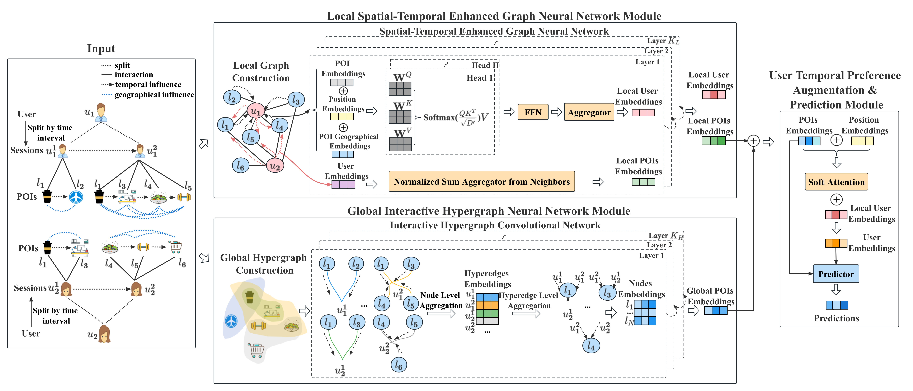

# MSTHN
The official PyTorch implementation for Multi-View Spatial-Temporal Enhanced Hypergraph Network for Next POI Recommendation, which is accepted to DASFAA2023 (CCF-B).

## Overview
Multi-View Spatial-Temporal Enhanced Hypergraph Network (MSTHN) designs a local spatial-temporal enhanced graph neural network, 
to capture important spatial-temporal correlations during aggregation and propagation, and a global interactive hypergraph neural network
to uncover complex high-order collaborative signals and mitigate check-in data sparsity issue for next POI recommendation.


## Requirements
```
python==3.7
torch==1.9.1
```

## Dataset
- Foursquare dataset is collected by Yang et al. 2015, and could be downloaded from [link](https://sites.google.com/site/yangdingqi/home/foursquare-dataset)
> Dingqi Yang, Daqing Zhang, Vincent W. Zheng, Zhiyong Yu. Modeling User Activity Preference by Leveraging User Spatial Temporal Characteristics in LBSNs. IEEE Trans. on Systems, Man, and Cybernetics: Systems, (TSMC), 45(1), 129-142, 2015
- Gowalla dataset is collected by Yin et al. 2015, and could be downloaded from [link](https://www.dropbox.com/sh/qy3s8rs66nirhl9/AAClmTnFO-rR-4ecEYO-jU4ba?dl=0)
> Yin, H., Cui, B., Chen, L., Hu, Z., Zhang, C.: Modeling location-based user rating profiles for personalized recommendation. ACM Transactions on Knowledge Discovery from Data (TKDD) 9(3), 1–41 (2015)

## Running
```
python run.py --dataset NYC
python run.py --dataest TKY
python run.py --dataset Gowalla
```

## License
```
MIT License

Copyright (c) 2023 Yantong Lai

Permission is hereby granted, free of charge, to any person obtaining a copy
of this software and associated documentation files (the "Software"), to deal
in the Software without restriction, including without limitation the rights
to use, copy, modify, merge, publish, distribute, sublicense, and/or sell
copies of the Software, and to permit persons to whom the Software is
furnished to do so, subject to the following conditions:

The above copyright notice and this permission notice shall be included in all
copies or substantial portions of the Software.

THE SOFTWARE IS PROVIDED "AS IS", WITHOUT WARRANTY OF ANY KIND, EXPRESS OR
IMPLIED, INCLUDING BUT NOT LIMITED TO THE WARRANTIES OF MERCHANTABILITY,
FITNESS FOR A PARTICULAR PURPOSE AND NONINFRINGEMENT. IN NO EVENT SHALL THE
AUTHORS OR COPYRIGHT HOLDERS BE LIABLE FOR ANY CLAIM, DAMAGES OR OTHER
LIABILITY, WHETHER IN AN ACTION OF CONTRACT, TORT OR OTHERWISE, ARISING FROM,
OUT OF OR IN CONNECTION WITH THE SOFTWARE OR THE USE OR OTHER DEALINGS IN THE
SOFTWARE.
```

